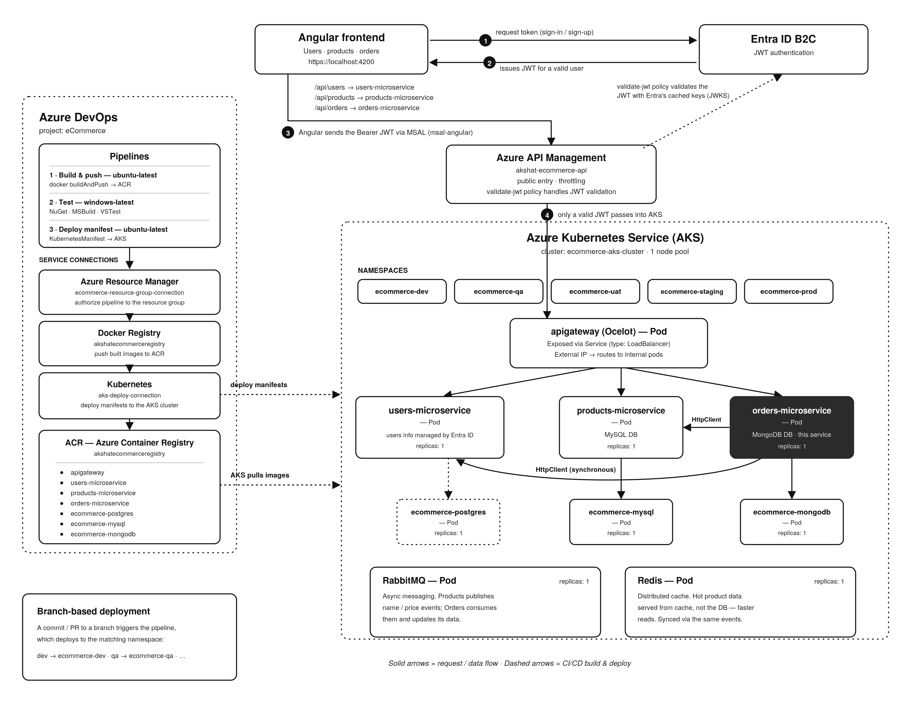

# Orders Microservice — eCommerce Solution

Part of a **3-service microservices architecture** built with **ASP.NET Core**, demonstrating clean architecture, polyglot persistence, and resilient inter-service communication.

## 📝 Note for Reviewers

[!IMPORTANT]
> This is a **cost-optimized learning deployment**. The databases run as **ephemeral pods with no persistent storage attached**, and the AKS cluster is shut down outside of demo hours to keep Azure costs near zero.

**What this means in practice:**
- **Data does not persist.** Products, users, and orders you create live only inside the pod's container filesystem.
- **State resets** whenever the cluster is turned off, or when pods are recreated (which happens on every restart — effectively a daily reset).
- Each pod comes back **fresh and empty**.
- If you revisit the app the next day, expect a **clean slate** — this is intentional, not a bug.

In a production setup, durability would come from **managed databases** (e.g., Azure Database for MySQL, Azure Cosmos DB) or **PersistentVolumes / StatefulSets** backed by Azure Disks, so data would survive restarts. That's deliberately left out here to keep the project free to host while still demonstrating the full CI/CD → AKS pipeline.

## 🏗️ Architecture Overview

This Orders Microservice is one of three services in a distributed eCommerce system:

| Service | Responsibility | Database |
|---------|---------------|----------|
| UsersService | User management — *JWT & registration* | Entra ID |
| ProductsService | Product catalog, search, inventory | MySQL |
| **OrdersService** (this repo) | Order processing, validation, aggregation | MongoDB |

Services communicate via **HTTP clients** with **Polly-based fault tolerance** (retry, circuit breaker, timeout, fallback).

## 🛠️ Tech Stack

**Backend**
- ASP.NET Core — Web API with Controllers
- MongoDB.Driver — native MongoDB client
- AutoMapper — DTO ↔ Entity mapping
- FluentValidation — nested validation (Order + OrderItems)
- Polly — Retry, Circuit Breaker, Timeout, Fallback policies

**Infrastructure**
- Docker & Docker Compose — multi-container orchestration  
- MongoDB — NoSQL document database
- Ocelot API Gateway
- Polyglot persistence (MongoDB, MySQL, PostgreSQL)

**Frontend** 
- Angular — UI for orders, products, users

## 📐 Project Structure (Clean Architecture)
├── ApiGateway/                      # Ocelot gateway routing requests to services  
├── BusinessLogicLayer/              # Services, DTOs, Mappers, Validators, Policies  
├── DataAccessLayer/                 # Repositories, Entities, MongoDB context  
├── ECommerceSolution.OrderService/  # API layer, Controllers, Program.cs, Dockerfile  
├── docker-compose.yml               # Multi-container orchestration  
└── docker-compose.override.yml      # Development overrides  

## ✨ Key Features

- ✅ **Microservices architecture** with HTTP-based communication
- ✅ **Cross-service validation** (Orders validates against Users & Products services)
- ✅ **Fault tolerance** via Polly (exponential backoff retry, circuit breaker, fallback)
- ✅ **Polyglot persistence** — different database per service
- ✅ **API Gateway** for unified entry point
- ✅ **Clean Architecture** — strict layer separation
- ✅ **FluentValidation** with nested validation rules
- ✅ **AutoMapper profiles** for clean DTO mappings

## Learning Project

Built while working through ".NET Microservices with Azure DevOps & AKS | Basic to Master"(https://www.udemy.com/course/dot-net-microservices-ecommerce-project-azure-devops-kubernetes-aks/learn/lecture/45853823?start=1#overview) by Harsha Vardhan on Udemy.

## 👨‍💻 Author

**Akshat Parasher** — Software Engineer | C#/.NET Developer | Germany 🇩🇪

- 🔗 [Portfolio](https://akshat95-portfolio.netlify.app)
- 🔗 [GitHub](https://github.com/AkshatAspNetCore)
- 🔗 [GitLab](https://gitlab.com/arkhamknight95-group)
